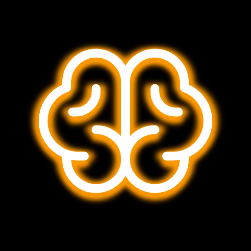

#  bt — Brain Training

A monorepo of cognitive training PWAs, installable and fully offline. A hub at the root links all apps and aggregates session history.

## Apps

### [nb](./nb/)

Visual-only [n-back task](https://en.wikipedia.org/wiki/N-back) with dual, triple, and quad modes (position, color, letter, shape). Most implementations use audio cues — this one is purely visual. Tracks position and color matches independently, with fire-particle progress feedback and milestone celebrations every 20 rounds.

### [clauer](./clauer/)

A stylish implementation of the [Symbol Digit Modalities Test](https://en.wikipedia.org/wiki/Symbol_Digit_Modalities_Test) (SDMT). A symbol-to-digit key is shown at the top; symbols appear one by one and you type the matching digit as fast as possible. Measures throughput (CPM), accuracy, stability (CV), and efficiency (IES).

### [tanmateix](./tanmateix/)

Fast-paced logic reasoning. Premises about entities and their relationships are shown; you judge whether the conclusion logically follows — True or False — before time runs out. Features linear, spatial, and syllogistic relation types. Difficulty adapts dynamically. Inspired by [Syllogimous-v3](https://github.com/soamsy/Syllogimous-v3). Uses [Tau Prolog](https://tau-prolog.org/) for logical inference.

### [summum](./summum/)

Arithmetic under pressure. A running sum is shown — tap True or False to confirm whether the latest total is correct. Pace tightens as you go. Measures accuracy and reaction pace across a fixed round set.

### [stop](./stop/)

[Stop Signal Task](https://en.wikipedia.org/wiki/Stop-signal_task). Arrows appear — tap the matching direction. When a triangle (▲) appears above the arrow, inhibit your response. Measures go accuracy, stop accuracy, average reaction time, and stop-signal delay (SSD), which adapts to keep inhibition at ~50%.

### [attn](./attn/)

Visual adaptation of the [Attention Training Technique](https://en.wikipedia.org/wiki/Attention_training_technique) (ATT) from Adrian Wells' Metacognitive Therapy. Trains voluntary attentional control — the ability to deliberately direct focus away from self-focused rumination. Three phases per session: selective attention (track one highlighted ball among identical moving distractors), attention switching (follow a sequence of flashes, identify the last), and divided attention (track three simultaneously highlighted balls). Ball count is configurable (3–15); the key metric is _effective balls_ (ball count × accuracy), which rewards both difficulty and performance.

### [rot](./rot/)

3D shape rotation matching. Six cubelet shapes are shown simultaneously, all slowly wobbling in 3D. Exactly two are identical — find the matching pair before the 2-minute timer runs out. Score is the number of correct matches. Colors are randomised per shape as a mild interference layer; the pair will never share a color.

### [precis](./precis/)

Two-mode compliance drill. **Literal**: a rule and an entity are shown; judge ALLOW or DENY by strict literal evaluation. **Exploit**: given a rule and a malicious objective (e.g. get ALLOW for a flagged, non-premium entity), toggle the entity's attributes to find the structural loophole — the OR branch, NOT flip, or UNLESS miss that lets the wrong entity through. Trains both reading rules like a compiler and red-teaming your own specs.

### [llei](./llei/)

Inductive rule learning. A set of labeled examples is shown — some LEGAL, some ILLEGAL — each as a row of binary property icons. Your task is to construct the boolean law (using AND, OR, NOT) that correctly classifies all of them. The rule is built visually with icon blocks and operator buttons; no typing required. Each puzzle uses at least three attributes and property positions are scrambled per card to prevent geometric pattern matching. Difficulty increases through levels, adding negation and tightening the timer.

### [regles](./regles/)

Set-shifting under memory load. A rule stack grows one rule per level over 10 levels — only the new rule is shown; all prior rules must be held in working memory. Tiles are cleared by tapping whichever one satisfies the current active rule; once all valid tiles for that rule are gone, the next rule in the stack becomes active. Tracks error rate, set-shift latency (time from rule change to first correct tap), and interference error rate (wrong taps that would have been valid under the prior rule).

## Structure

```
bt/
├── index.html        # Hub — links all apps, cross-app streak, per-app history
├── app.js            # Hub logic
├── style.css         # Hub styles
├── sw.js             # Root service worker (caches everything)
├── get_cache.go      # Crawl tool to regenerate sw.js cache list
├── shared/
│   ├── fire.js       # Canvas fire particle system
│   ├── haptic.js     # Haptic feedback
│   ├── storage.js    # localStorage factory (makeStorage)
│   ├── history.js    # Calendar + trend chart history UI (makeHistoryUI)
│   └── fonts/        # Shared fonts (Inter, Phosphor, Monoid, …)
├── nb/
├── clauer/
├── tanmateix/
├── summum/
├── stop/
├── attn/
├── regles/
└── rot/
```

## Offline

Visiting the hub once caches all assets for all apps. Sub-apps (clauer, nb, tanmateix) also register their own service workers for independent offline use. After `go run get_cache.go`, paste the output into `sw.js` to update the cache manifest.
